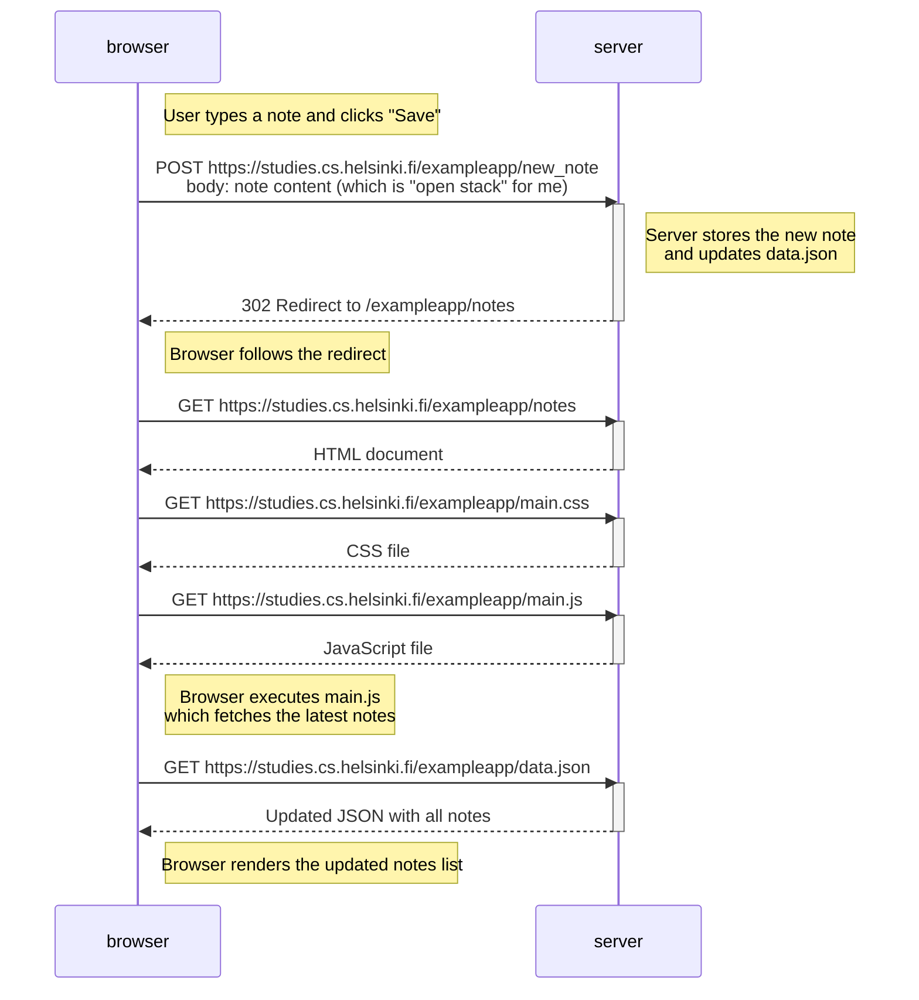

# Exercise 0.4 – New Note Diagram (Traditional Notes App)

This diagram shows what happens when a user creates a new note on  
https://studies.cs.helsinki.fi/exampleapp/notes  
and clicks the Save button.

