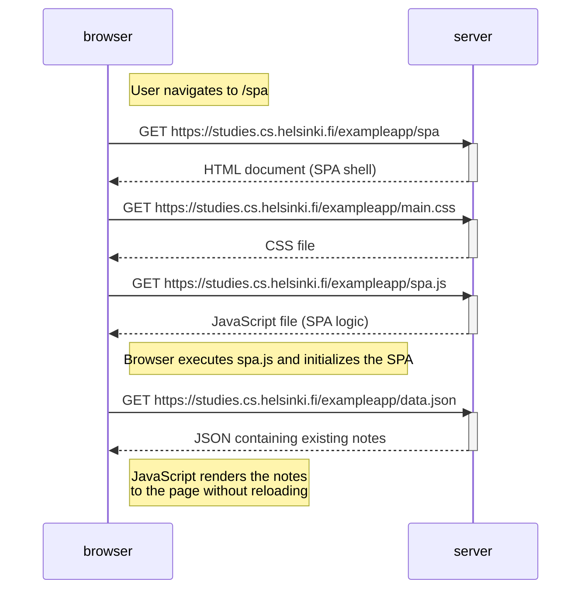

# Exercise 0.5 – SPA Load Diagram

This diagram shows what happens when the user opens the single-page app  
at https://studies.cs.helsinki.fi/exampleapp/spa.

```mermaid
sequenceDiagram
    participant browser
    participant server

    Note right of browser: User navigates to /spa

    browser->>server: GET https://studies.cs.helsinki.fi/exampleapp/spa
    activate server
    server-->>browser: HTML document (SPA shell)
    deactivate server

    browser->>server: GET https://studies.cs.helsinki.fi/exampleapp/main.css
    activate server
    server-->>browser: CSS file
    deactivate server

    browser->>server: GET https://studies.cs.helsinki.fi/exampleapp/spa.js
    activate server
    server-->>browser: JavaScript file (SPA logic)
    deactivate server

    Note right of browser: Browser executes spa.js and initializes the SPA

    browser->>server: GET https://studies.cs.helsinki.fi/exampleapp/data.json
    activate server
    server-->>browser: JSON containing existing notes
    deactivate server

    Note right of browser: JavaScript renders the notes<br>to the page without reloading
```
