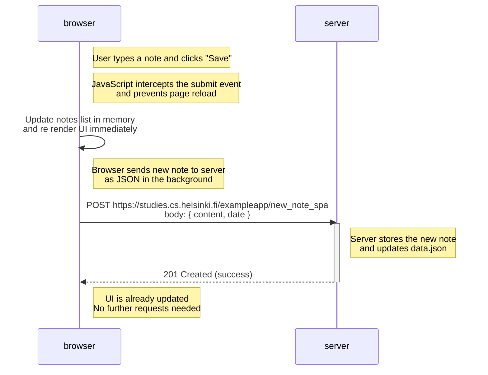

# Exercise 0.6 – New Note in Single-Page App Diagram

This diagram shows what happens when the user creates a new note  
inside the single-page app version at  
https://studies.cs.helsinki.fi/exampleapp/spa.

